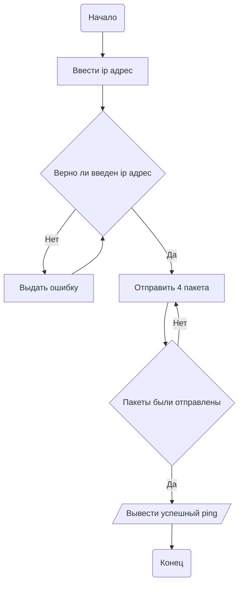
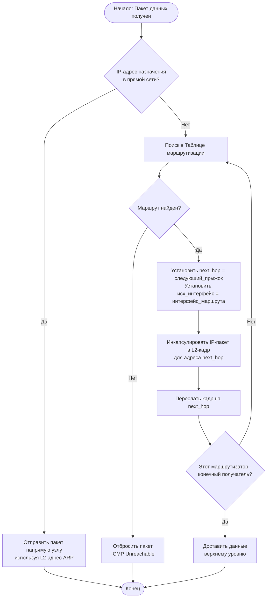

**Составление блок-схем с помощью mermaid**
задание №1"


Задание №2


Задание №3 

```mermaid

flowchart TD

    A[Начало SSH подключения] --> B[Клиент: Ввод команды SSH]

    B --> C[Установка TCP-соединения]

    C --> D{Соединение установлено?}

    D -- Нет --> E[Ошибка сети]

    E --> F[Конец: Сбой подключения]

    D -- Да --> G[Обмен версиями SSH]

    G --> H[Начало шифрованной сессии]

    H --> I[Сервер запрашивает аутентификацию]

    I --> J[Установка счетчика: attempts = 3]

    J --> K[Ввод пароля]

    K --> L{Пароль верный?}

    L -- Да --> M[Аутентификация успешна]

    L -- Нет --> N[Attempts = attempts - 1]

    N --> O{Attempts > 0?}

    O -- Да --> K

    O -- Нет --> P[Доступ запрещен]

    P --> Q[Сервер разрывает соединение]

    Q --> R[Конец: Отказ доступа]

    M --> S[Доступ предоставлен]

    S --> T[Подключение установлено]

    T --> U[Работа в SSH сессии]

    U --> V[Конец: Выход из сессии]

   ```