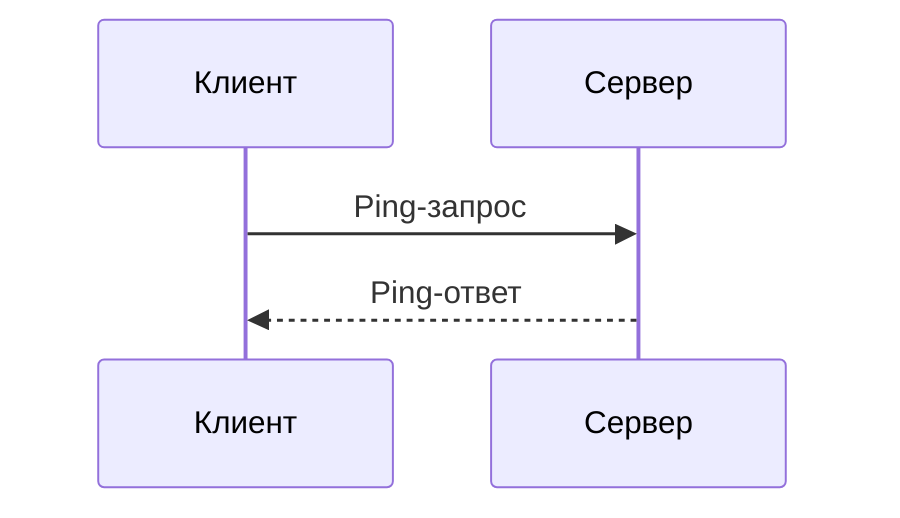
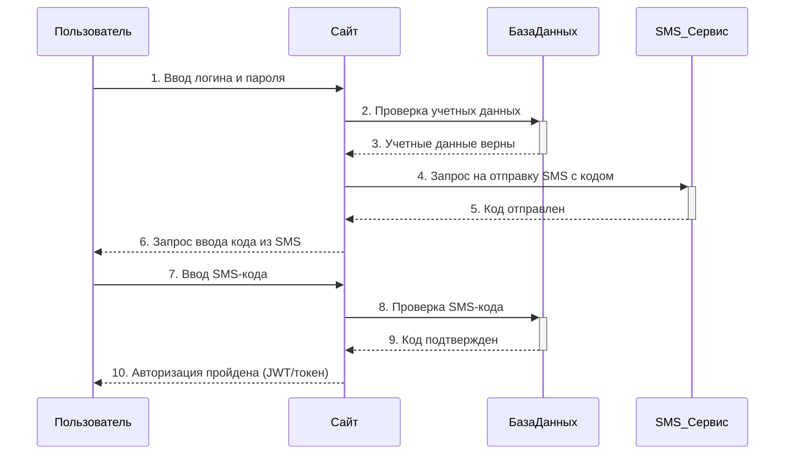
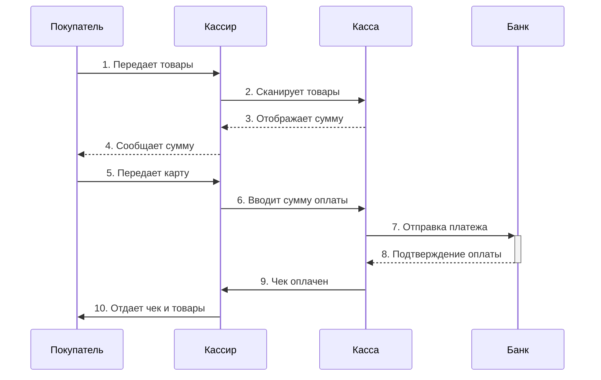
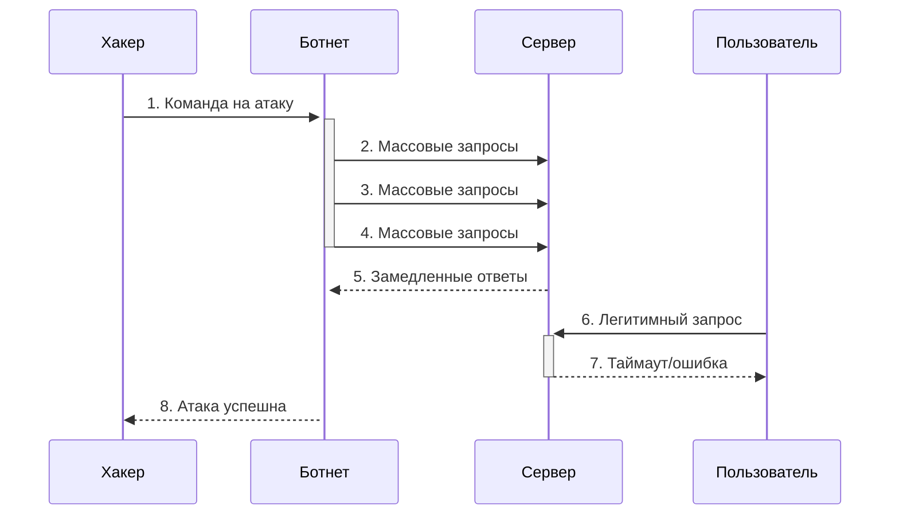

## Составление блок-схем с помощью mermaid - sequence-диаграммы

1.

```mermaid
sequenceDiagram
    participant Клиент
    participant Сервер

    Клиент->>Сервер: Ping-запрос 
    Сервер-->>Клиент: Ping-ответ
```
2.

```mermaid
sequenceDiagram
    participant Пользователь
    participant Сайт
    participant БазаДанных
    participant SMS_Сервис

    Пользователь->>Сайт: 1. Ввод логина и пароля
    Сайт->>+БазаДанных: 2. Проверка учетных данных
    БазаДанных-->>-Сайт: 3. Учетные данные верны
    
    Сайт->>+SMS_Сервис: 4. Запрос на отправку SMS с кодом
    SMS_Сервис-->>-Сайт: 5. Код отправлен
    Сайт-->>Пользователь: 6. Запрос ввода кода из SMS
    
    Пользователь->>Сайт: 7. Ввод SMS-кода
    Сайт->>+БазаДанных: 8. Проверка SMS-кода
    БазаДанных-->>-Сайт: 9. Код подтвержден
    
    Сайт-->>Пользователь: 10. Авторизация пройдена (JWT/токен)
```
3.

```mermaid
sequenceDiagram
    participant Покупатель
    participant Кассир
    participant Касса
    participant Банк

    Покупатель->>Кассир: 1. Передает товары
    Кассир->>Касса: 2. Сканирует товары
    Касса-->>Кассир: 3. Отображает сумму

    Кассир-->>Покупатель: 4. Сообщает сумму
    Покупатель->>Кассир: 5. Передает карту
    Кассир->>Касса: 6. Вводит сумму оплаты

    Касса->>+Банк: 7. Отправка платежа
    Банк-->>-Касса: 8. Подтверждение оплаты
    Касса->>Кассир: 9. Чек оплачен

    Кассир->>Покупатель: 10. Отдает чек и товары
```
4.

```mermaid
sequenceDiagram
    participant Хакер
    participant Ботнет
    participant Сервер
    participant Пользователь

    
    Хакер->>+Ботнет: 1. Команда на атаку
    
    activate Ботнет
    Ботнет->>Сервер: 2. Массовые запросы #1
    Ботнет->>Сервер: 3. Массовые запросы #2
    Ботнет->>Сервер: 4. Массовые запросы #3
    deactivate Ботнет
    
    Сервер-->>Ботнет: 5. Замедленные ответы
    
    
    Пользователь->>+Сервер: 6. Легитимный запрос
    Сервер-->>-Пользователь: 7. Таймаут/ошибка
    
    
    Ботнет-->>Хакер: 8. Атака успешна
```