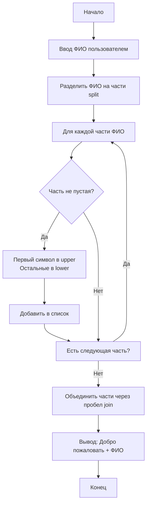
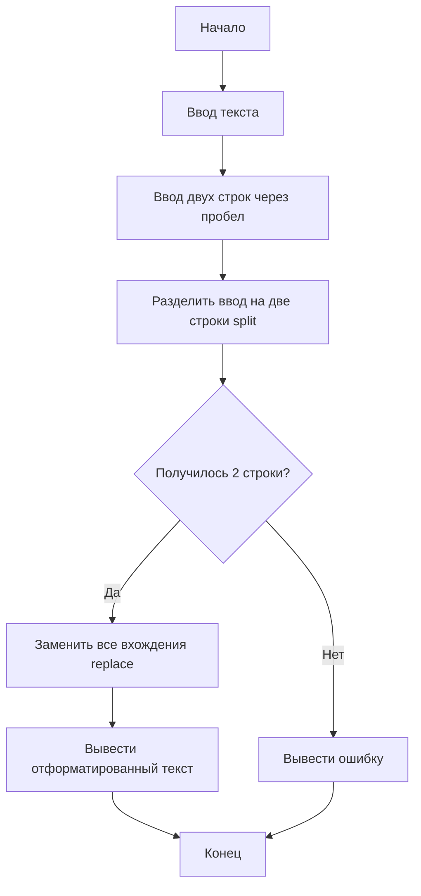
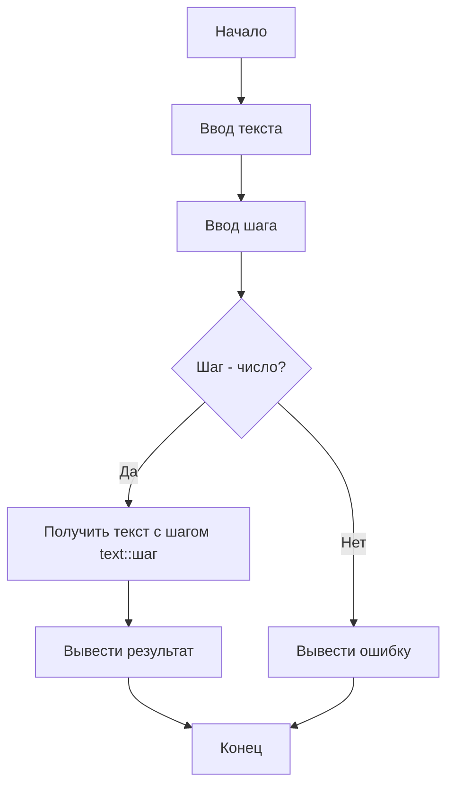
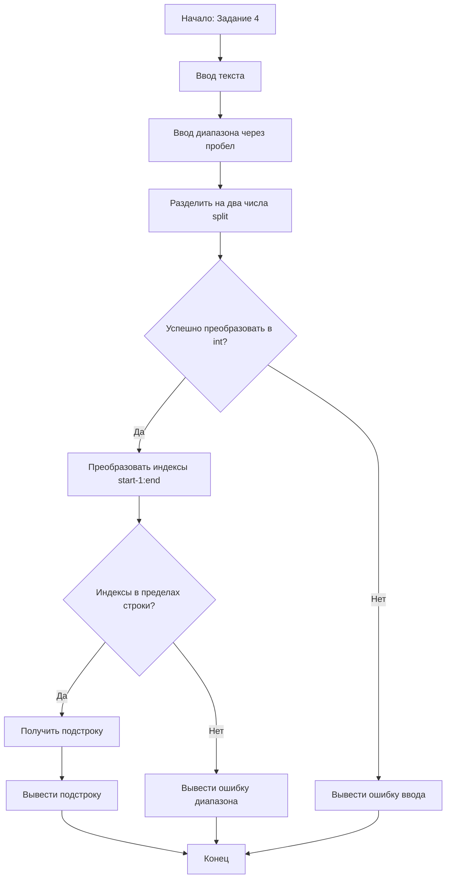
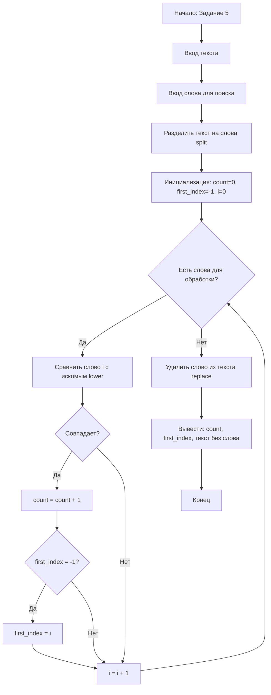

## Введение в Python. Методы строк

Задание №1

```mermaid
graph TD
    A[Начало] --> B[Ввод ФИО пользователем]
    B --> C[Разделить ФИО на части split]
    C --> D[Для каждой части ФИО]
    D --> E{Часть не пустая?}
    E -- Да --> F[Первый символ в upper<br>Остальные в lower]
    F --> G[Добавить в список]
    G --> H[Есть следующая часть?]
    E -- Нет --> H
    H -- Да --> D
    H -- Нет --> I[Объединить части через пробел join]
    I --> J[Вывод: Добро пожаловать + ФИО]
    J --> K[Конец]
```
2.

```mermaid
graph TD
    A[Начало] --> B[Ввод текста]
    B --> C[Ввод двух строк через пробел]
    C --> D[Разделить ввод на две строки split]
    D --> E{Получилось 2 строки?}
    E -- Да --> F[Заменить все вхождения replace]
    F --> G[Вывести отформатированный текст]
    G --> H[Конец]
    E -- Нет --> I[Вывести ошибку]
    I --> H
```
3.

```mermaid
graph TD
    A[Начало] --> B[Ввод текста]
    B --> C[Ввод шага]
    C --> D{Шаг - число?}
    D -- Да --> E[Получить текст с шагом text::шаг]
    E --> F[Вывести результат]
    F --> G[Конец]
    D -- Нет --> H[Вывести ошибку]
    H --> G
```
4.

```mermaid
graph TD
    A[Начало: Задание 4] --> B[Ввод текста]
    B --> C[Ввод диапазона через пробел]
    C --> D[Разделить на два числа split]
    D --> E{Успешно преобразовать в int?}
    E -- Да --> F[Преобразовать индексы start-1:end]
    F --> G{Индексы в пределах строки?}
    G -- Да --> H[Получить подстроку]
    H --> I[Вывести подстроку]
    I --> J[Конец]
    G -- Нет --> K[Вывести ошибку диапазона]
    K --> J
    E -- Нет --> L[Вывести ошибку ввода]
    L --> J
```
5.

```mermaid
graph TD
    A[Начало: Задание 5] --> B[Ввод текста]
    B --> C[Ввод слова для поиска]
    C --> D[Разделить текст на слова split]
    D --> E[Инициализация: count=0, first_index=-1, i=0]
    E --> F{Есть слова для обработки?}
    F -- Да --> G[Сравнить слово i с искомым lower]
    G --> H{Совпадает?}
    H -- Да --> I[count = count + 1]
    I --> J{first_index = -1?}
    J -- Да --> K[first_index = i]
    K --> L[i = i + 1]
    J -- Нет --> L
    H -- Нет --> L
    L --> F
    F -- Нет --> M[Удалить слово из текста replace]
    M --> N[Вывести: count, first_index, текст без слова]
    N --> O[Конец]
```