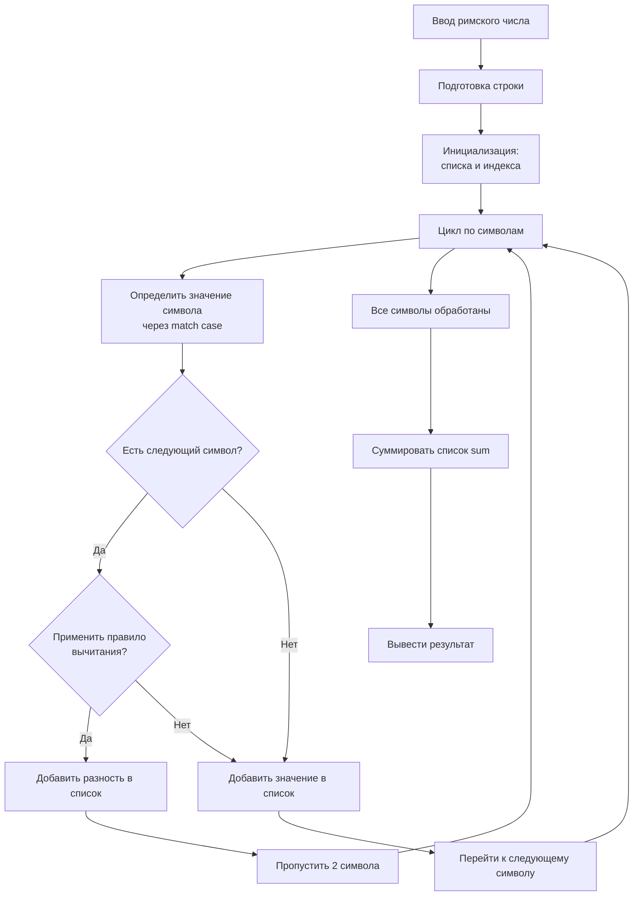

## Контрольная работа по первому деделайну

6 Вариант.

```mermaid
graph TD
    A[Ввод римского числа] --> B[Подготовка строки]
    B --> C[Инициализация:<br>списка и индекса]
    C --> D[Цикл по символам]
    
    D --> E[Определить значение символа<br>через match case]
    E --> F{Есть следующий символ?}
    F -- Да --> G{Применить правило<br>вычитания?}
    G -- Да --> H[Добавить разность в список]
    H --> I[Пропустить 2 символа]
    G -- Нет --> J[Добавить значение в список]
    J --> K[Перейти к следующему символу]
    
    F -- Нет --> J
    
    I --> D
    K --> D
    
    D --> L[Все символы обработаны]
    L --> M[Суммировать список sum]
    M --> N[Вывести результат]
```