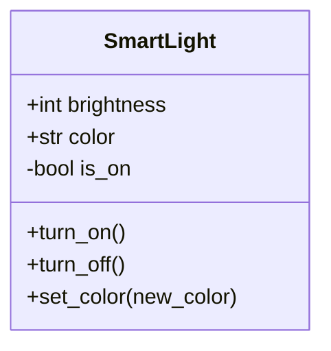
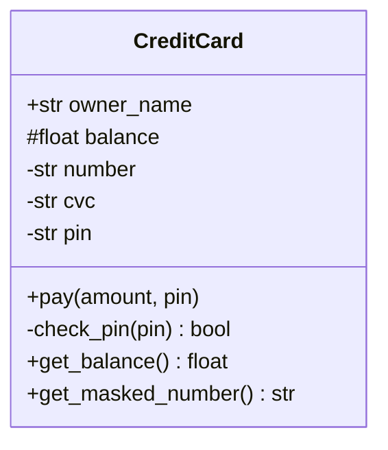
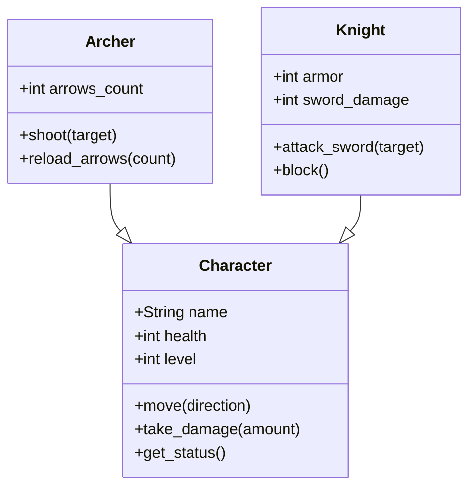
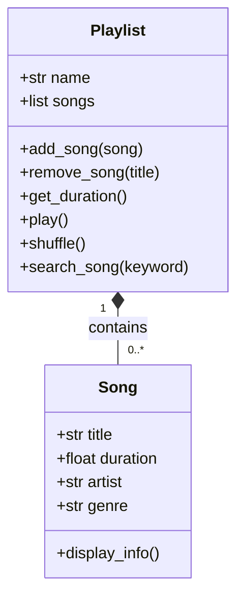
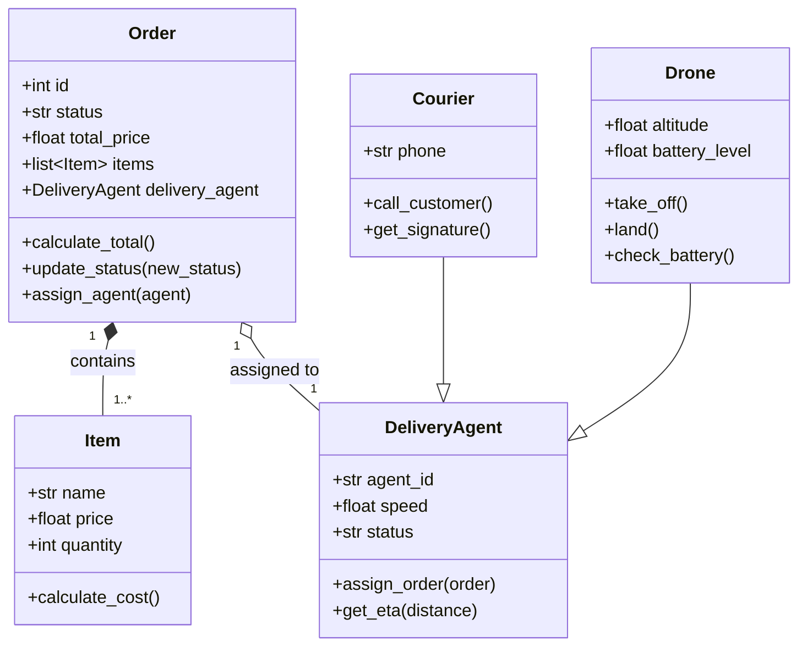
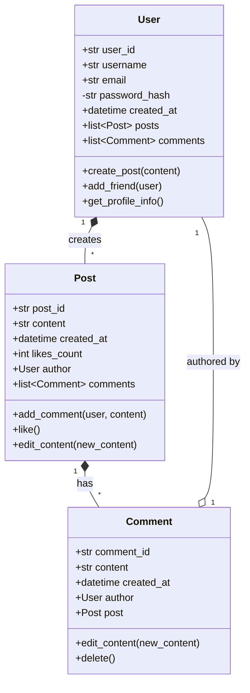

Задание №1

Задание №2

Задание №3

Задание №4

Задание №5

Задание №6

Обоснование:
1.Пост не может быть без автора. Если удалить пользователя, его посты тоже удаляются.  

2.Комментарий не может быть без поста. Если удалить пост, комментарии тоже удаляются.  
  
3.Пользователь может существовать без комментариев. Если удалить комментарий, пользователь остаётся.